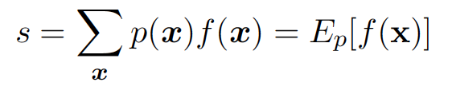
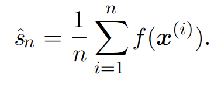
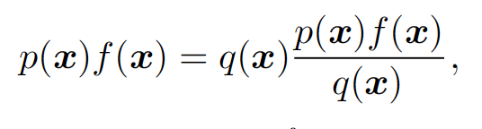
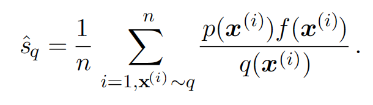
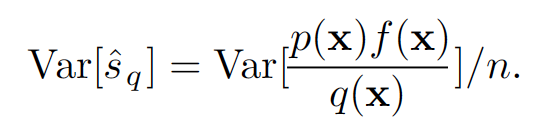

# Ch 17. Monte Carlo Methods

## Randomized Algorithms
* Las Vegas
 * precise correct answer with a random amount of resources (time or memory)
   deterministic approximation
* Monte Carlo
 * answer with a random amount of error
 * error will be reduced by expending more resources

## Why sampling in Machine learning

* a way of approximate many sums and integral at reduced cost
* esp. in case of intractable sum such as partition function

## Monte Carlo sampling

* approximate the expectation by empirical average

* law of large number tells that average converge surely to the expected value
* central limit theorem tells that distribution of average converges to a normal distribution with true expectation as mean and true variance divided by n as variance
* When cannot sample from base distribution?? => use importance sampling

##  importance sampling

* sometime it is very hard to sample from p
* sample from q instead of p

* expected value of the estimater does not depend on q (Good!!)
* variance of the estimater can be greatly sensitive to the choice of q (Bad!!)

* What's good/optimal choice of q
 * minimal variance occurs when q* sums or integrates to 1 as appropriate
 
 * poor choice of q when pf/q is large
   * q >> pf (useless tiny numbers)
   * q << pf (large variance)
