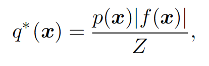
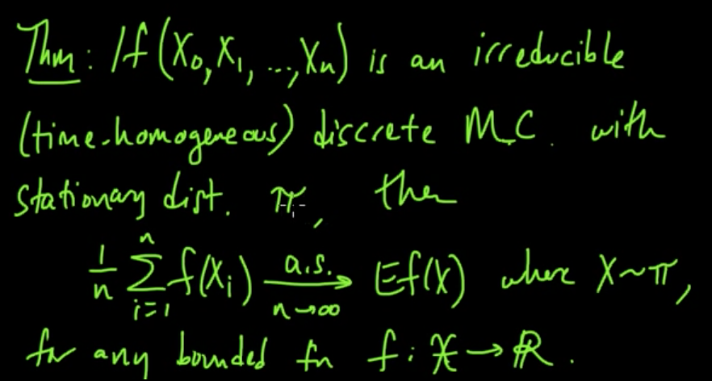
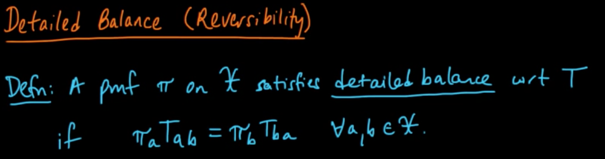
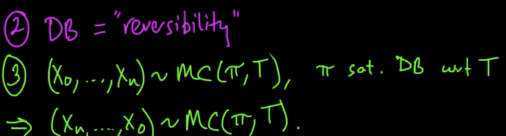
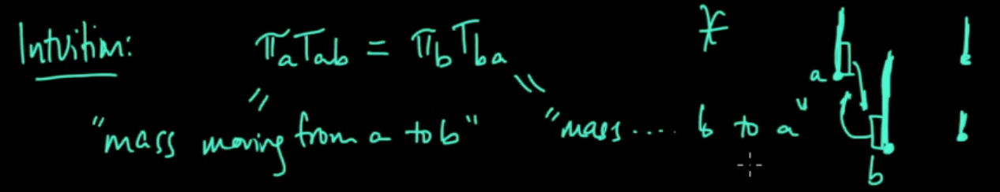
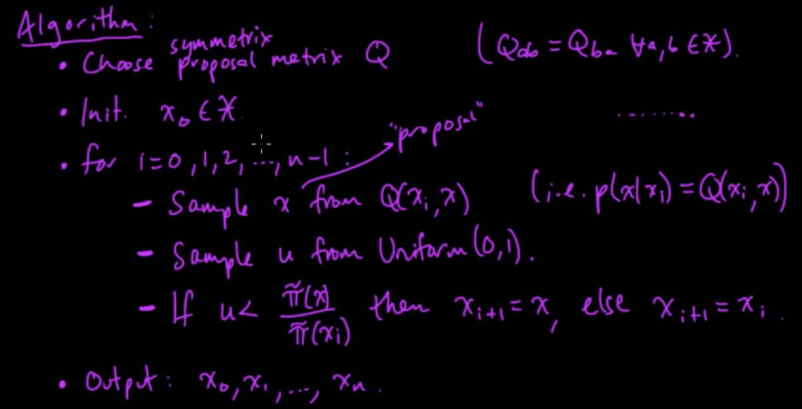
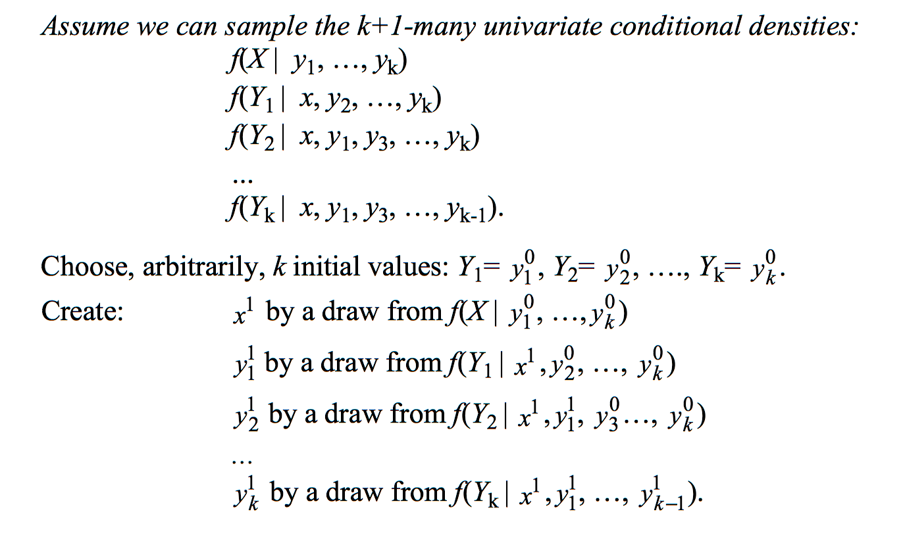
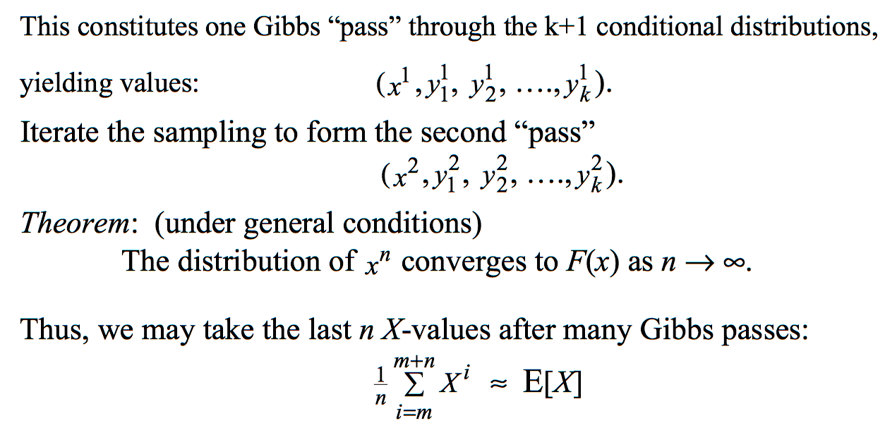
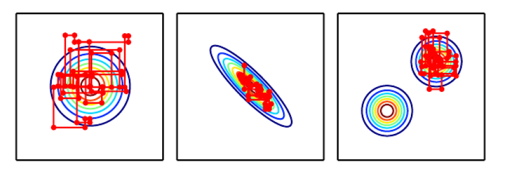
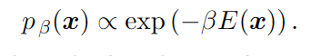

# Ch 17. Monte Carlo Methods

## Randomized Algorithms
* Las Vegas
 * precise correct answer with a random amount of resources (time or memory)
   deterministic approximation
* Monte Carlo
 * answer with a random amount of error
 * error will be reduced by expending more resources

## Why sampling in Machine learning

* a way of approximate many sums and integral at reduced cost
* esp. in case of intractable sum such as partition function

## Monte Carlo sampling

* approximate the expectation by empirical average

* law of large number tells that average converge surely to the expected value
* central limit theorem tells that distribution of average converges to a normal distribution with true expectation as mean and true variance divided by n as variance
* When cannot sample from base distribution?? => use importance sampling

##  importance sampling

* sometime it is very hard to sample from p
* sample from q instead of p

* expected value of the estimater does not depend on q (Good!!)
* variance of the estimater can be greatly sensitive to the choice of q (Bad!!)

* What's good/optimal choice of q
 * minimal variance occurs when q* sums or integrates to 1 as appropriate
 
 * poor choice of q when pf/q is large
    * q >> pf (useless tiny numbers)
    * q << pf (large variance)

## Markov chain

* sample from irreducible,aperiodic,stationary markov chain leads to approximation of expectation

 * **irreducible** : there's at least one path from anywhere to anywhere in markov chain
 * **aperiodic** : there's no repeated tendency of state transition
 * **stationary** : convergence in a distribution with respect to time

#### Detail balance leads to stationary

* prob mass exchange in balance

* symmetry from 1 to n and n to 1

* intuition from mass exchange

#### metropolis algorithm

* produce samples which obey ergodic properties
* sample mean from those samples leads to approximation of expectation
* how to do it ?
 * proposal on transition matrix
 * choose next one and test whether it is accepted or rejected
 * those accepted series turn out to be ergodic process
 

## Markov chain monte carlo Methods

* hard to sample from true dist p, or importance sampling dist q
* Instead, we need to approximately sample from p by markov chain
* precondition is of no zero-probability
 * or no zero-energy in energy-based model
* Why markov chain?
 * In EBM, in undirected graph, sampling is difficult due to intractable cases
 * In acyclic, in directed graph, it is quite easy to sample due to tractable cases
* what internals in markov chains ?
 * pdf of states eventually converges to equilibrium distribution
  * all eigenvalues decay to zero except single 1 eigenvalue
  * rate of convergence is related to the second largest eigenvalue decay
  * is called "burning in"
  * no theory yet for deciding whether equilibrium achieved or not

## Gibbs sampling
* http://www.cs.cmu.edu/~tom/10-702/GibbsAndMCMCsampling.pdf
* as a variation of EM Algorithms
* if bivarate x,y, sample x1 from y0, then y1 from x1, and so on.
 * converges to true dist p(x)

* select one variable x and sampling it from pmodel conditioned on its neighbors in the undirected graph defined in energy-based model
* usually do not use metropolis-hastings algorithm in deep learning

## The challenge of mixing between separated modes

* mix mean samples from almost all areas of sample space x
* slow mix or even failure to mix
 * mcmc is like noisy gradient descent on the energy function
 * or like noisy hill climbing on the probability with respect to the state of the chain
 * the energy function may have several modes, each of blockaded by high energy barriers, hard to jump to one another

* how to avoid slow mix
 * make low of high energy barriers
  * by introducing controlling peaked distribution
  
  * by making deep neighbors
