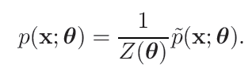

# Ch 17. Confronting the partition function

* in undirected graph, many probabilistic models could be unnormalized dist.
* need to be normalized by partition function
* usually, computing partition function is intractable

## The log-likelihood gradient

* in gradient descent, decomposed into positive phase, and negative phase

* positive phase,
 * depending on data and parameters,
 * usually tractable/straightforward
* negative phase
 * partition ft depending on parameters,
 * usually intractable
 * results in expectation of gradient of log-likelihood w.r.t. p(x)
 
* In energy-based learning,
 * positive phase => push down energy of training examples
  * negative phase => push up on the energy of samples drawn from the model

## Contrastive Divergence(CD)

* By naive mcmc
 * to estimate expectation of gradient of log-likelihood, sample from models by mcmc
 * Each step of gradient descent, perform mcmc by gibbs sampling
 * to burn-in(or mix-in), sufficient k gibbs steps are required
 * but it is computationally expensive

* meaning of negative sample
 * draw from model's distribution
 * finding points that the model believes in strongly
 * considered to represent the model's incorrect beliefs about the world
 * hallucinations or fantasy particles

* By Contrastive Divergence
 * main cost of naive mcmc is the cost of burning in the markov chains from a random initialization at each step
 * more clever solution is to initialize markov chains from a distribution that is very close to the model distribution
 * how to? use initial samples from the data distribution(Hinton 2000)

* CD suffers from spurious model
 * CD fails to suppress spurious mode
 * spurious mode that data dist low, but model dist is high
 * CD initialize mc from data points and then go around in a few steps, it is unlikely to visit spurious modes

 

 * CD is usually useful for shallow RBM, useful for pretraining shallow models that will later be stacked

* persistent CD(PCD) or SML
 * initialize mc with their states from the previous gradient step
 * vulerable when model dists changes a lot at each of gradient step

## Pseudo-likelihood

* the better way dealing with partition function is not to compute at all
* by make use of computation of ratios of probabilities

* for conditional probabilities, it takes ratio-based form
* a, c, should have small cases for tractability

* for n variables, each of which are conditionally dependent, Pseudo-likelihood is the following

* if each random variable has k different values, this requires only k*n evaluation, not kth n evaluation

* maximum of Pseudo-likelihood is asymptotically consistent
