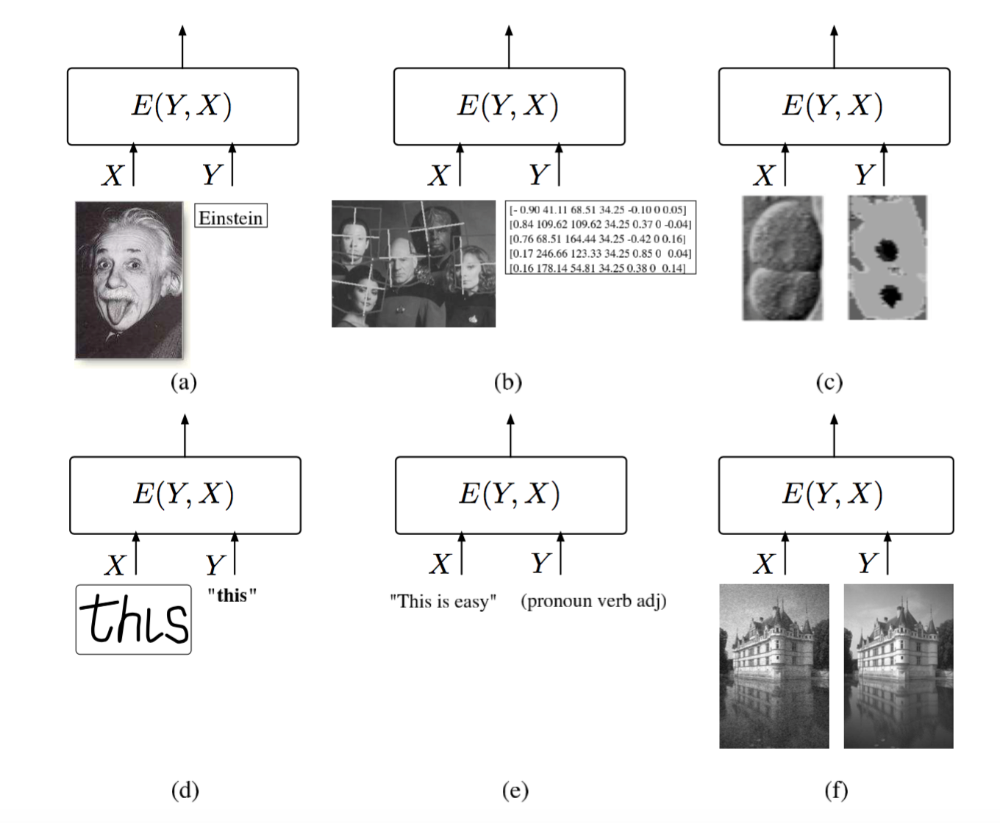
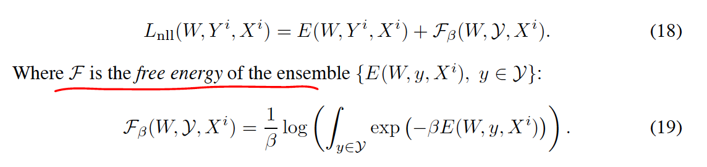

# Energy based learning

[paper](http://yann.lecun.com/exdb/publis/pdf/lecun-06.pdf)

## Energy based model
Capture dependencies by associating a scala energy(a measure of compatibility) to each configuration of the variables

## Energy based inference
energy function which measure goodness(or badness) of each possible configuration of X, y

## Uncalibrated energy into probability by Gibbs distribution

only allowed when
* the integral part converges

impractical when
* intractable when cardinality of y is so High
* or y is a high dimensional so that integral has no analytical solution

## Energy-based training
search for best energy function within a family of energy function indexed by a parameter W

define loss function and minimize

### Designing loss functional
must shape the energy surface so that the desired value of Y has lower energy than all the other(undesired) values

### Examples of Loss function

#### Energy loss
push down correct one

#### Generalized Perceptron loss
push down correct one and pull up the others
problem is to become flat energy surface

#### Generalized Margin loss
create form of margin to create an energy gap between correct answer and the incorrect answers

##### Hinge loss
special example of margin loss

##### Log loss
special example of margin loss

##### MCE loss
step function or soften logistic function

##### square-square loss
pin-down the correct energy at zero and pin down the incorrect answer energy above m

##### square-exponential loss

#### Negative Log-Likelihood loss

based on maximum conditional probability principle
