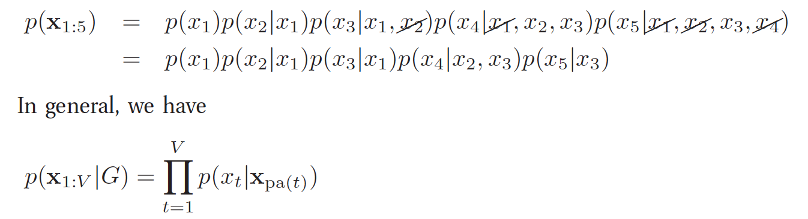

# Introduction

two principles of treating complex system
* modularity & abstraction

## Chain Rule

* the problem is that it becomes more and more complicated to represent CPD as t gets large
 * O(K^V)

## Conditional Independence

X and Y are conditionally independent given Z

future is independent of the past given the present

* called first order markov chain

## Graphical Models

* is a way to represent a joint distribution by making CI assumptions
* lack of edge is CI assumptions
* terminologies
 * Parent, Child, Family, Ancestors, Descendants, Neighbors
 * Topological Ordering
 * Path or Trail
 * Tree, SubGraph, Clique

## Directed graphical Models

* GM whose graph is a DAG
 * known as baysian network, belief network, causal network
* ordered markov property
 * node only depends on its immediate parents, not on all predecessors in topological Ordering

# Examples

## Naive Bayes classifiers

* features are independent

* tree-augmented naive Bayes
 * see figure 10.2 (b)

## Markov and hidden Markov Models

* first-order
* second-order
* hidden markov model
  * hidden/observation variables
   * word/waveform
  * transition/observation model
  * estimate hidden state given data

## Medical diagnosis
## Genetic linkage analysis
## Directed Gaussian graphical Models

* all variables are real-valued
* all the CPDs have gaussian form
* called gaussian bayes net

# Inference

* probabilistic Inference
 * task of estimating unknown quantities from known quantities

* posterior of unknown given knowns

* query variables by marginalizing out the nuisance variables
 

# learning

* inference is computing posterior of unknown given knowns
* learning is task of computing MAP estimate of the parameters given data
 
* In baysian view, inference and learning are same
 * parameters are also node in graph

## plate notation

* data is usually iid
* order of data is meaningless

## Learning from complete data

* complete data
 * no missing data, no hidden variables

* factored likelihood with node t

* factored prior
  

* factored posterior
 * factored prior plus factored likelihood implies factored posterior

## learning from missing/latent variables

* likelihood no longer factorized
* no longer convex
* only compute locally optimal ML/MAP
