# 보안이란?
## 침해
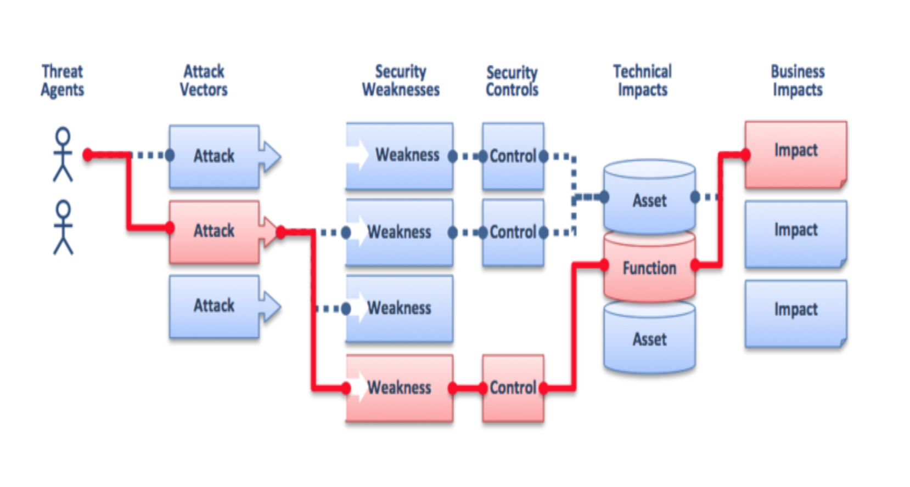

## attack vector
  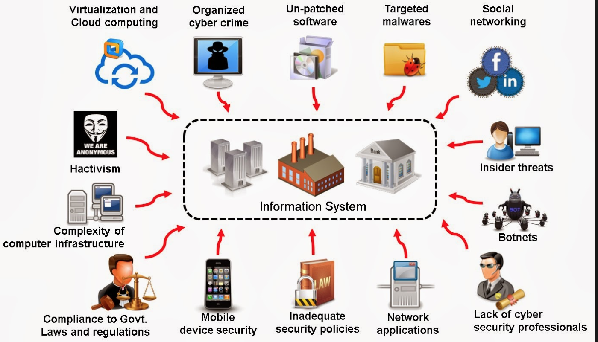

## Malware
* 공격 코드는 매우 작음 (수 바이트)
* 잠복성
* 변종 창궐 => Non-stationary
* 탐지 회피
 * 난독화,
 * Anti-AV
 * Anti-Debug
 * Anti-Disassemble/, Anti-VM

# AntiVirus
## 초창기 전통적 방식
* Signature-based : 일치 혹은 유사
* heuristics

## 현대적 방식
* Static analysis
 * 비정상적 코드 조각/흐름 탐지
* Dynamic analysis
 * 가상 머신 안에서의 시뮬레이션

## 탐지 방식
* Human expert
* Rule-based expert
* Machine learning with feature engineering
* Deep learning with feature learning

## ML/DL 적용의 어려움
* 공격 코드가 개성있고 창의적임 => 안정적인 통계적 특성이 약함
* Human expert의 반감
* label된 데이터가 대중에게 공개가 어려움

# Deep Learning Security

## Microsoft kaggle challenge 2015
* 일종의 자연어처럼, 그림처럼

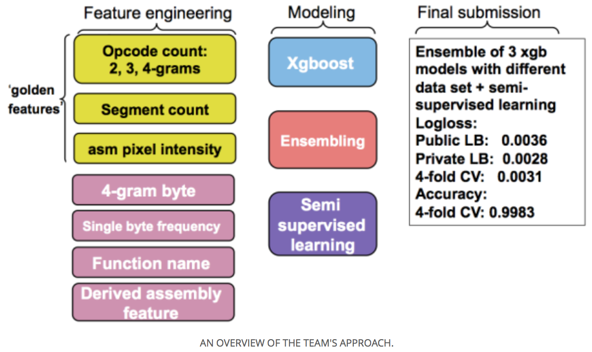

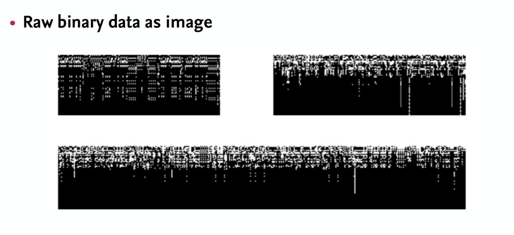

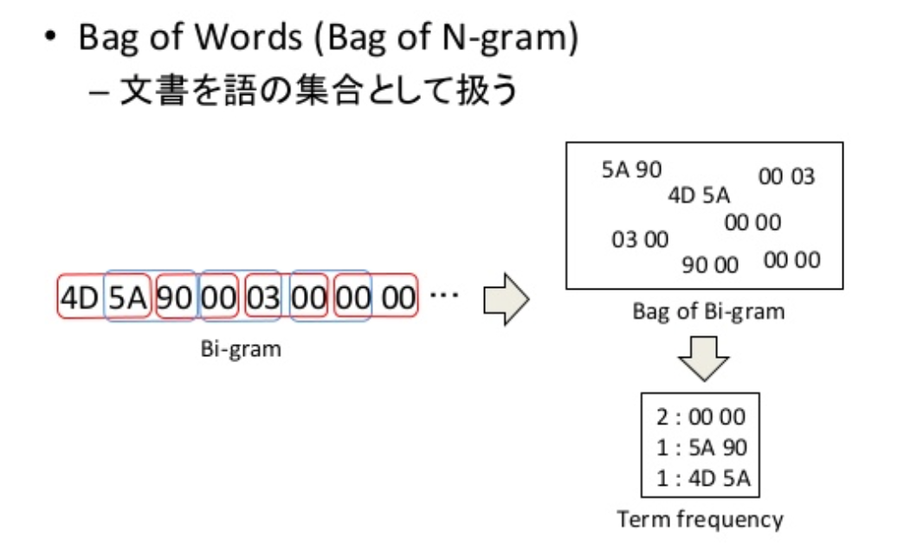

## 난독화된 코드 조각에서 함수 탐지
* 논문
 * https://people.eecs.berkeley.edu/~dawnsong/papers/Recognizing%20functions%20in%20binaries%20with%20neural%20networks_augsut%202015.pdf
* 해커는 각종 기법으로 code following/debuging을 못하게 코드를 뒤섞음
* 전통적인 debugger tool 로는 탐지 불가
* 일종의 자연어로 보고 RNN 적용
* 유사 사례 : Sung kim 교수님의 자동 코드 작성기

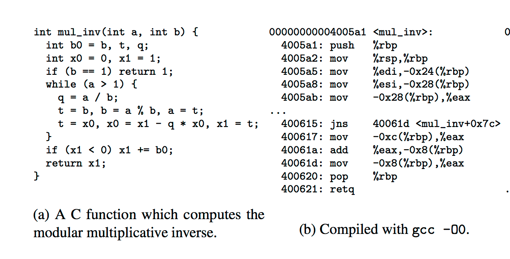

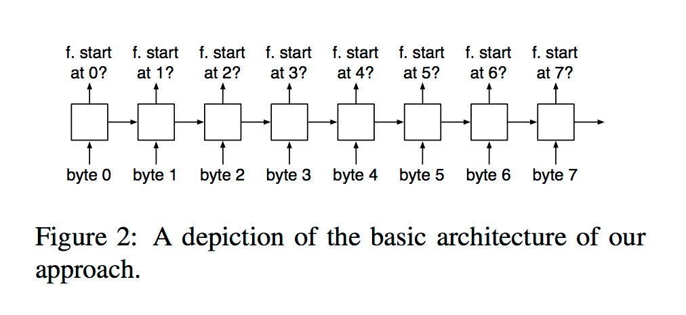

## Malware Classification with RNN, MS, 2015

* 논문
 * https://www.microsoft.com/en-us/research/wp-content/uploads/2016/02/pascanuIcassp2015.pdf

* 자연어, ECN + RNN

## 난독화된 JavaScript 코드
* 논문
 * https://www.researchgate.net/publication/254307605_Analysis_and_Identification_of_Malicious_JavaScript_Code

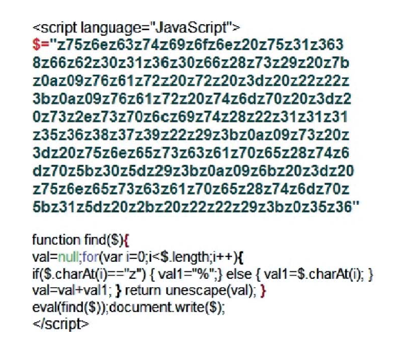  

* 난독화 해제 거의 불가능
* handcraft-feature selection ++ NN
 * 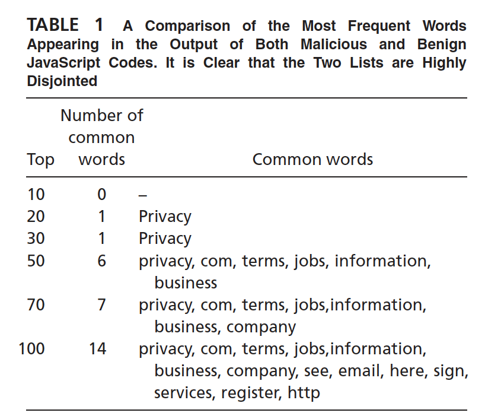  

 * 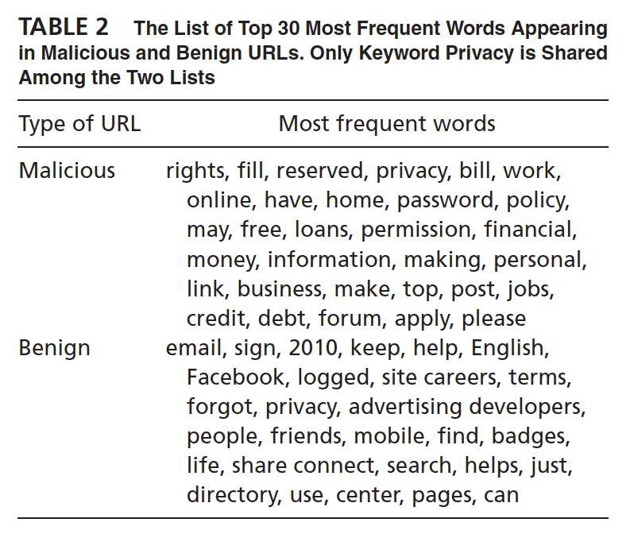

 * 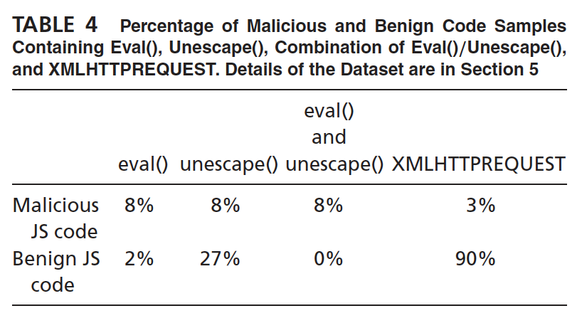  

* A deep learning approach for detecting malicious JavaScript code (2016)

* Building Program Vector Representations for Deep Learning
http://sei.pku.edu.cn/~moull12/resource/PLP.pdf

* reference
http://www.slideshare.net/liorrokach/cyber-securityshort
http://www.slideshare.net/nasirbhutta/cyber-security-trends-and-globar-war
